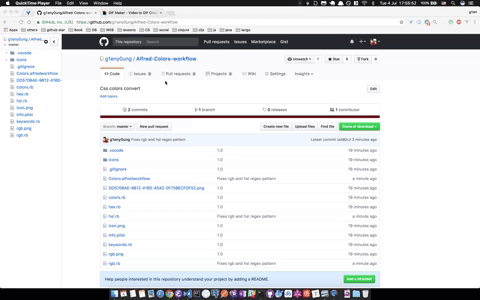

# Alfred-Colors-workflow

[Download](https://github.com/g1eny0ung/Alfred-Colors-workflow/raw/master/dist/Colors.alfredworkflow)

CSS colors conversion (**hex, rgb, hsl**)

The keyword is **c**, you can change it with your habit.



## Pre Install

```sh
brew install ruby
gem install chunky_png
```

## Format

### keywords

* black => #000
* darkblue => #00008b
* yellowgreen => #9acd32

### hex

* #ffffff
* ffffff
* #fff
* fff

### rgb

> rgb(...) is optional

* rgb(255, 255, 255)
* rgb(255|255|255)
* rgb(255 255 255)
* rgb(255-255-255)

### hsl

> hsl(...) is optional

* hsl(0, 0%, 100%)
* same as rgb

## Credits

<div>Icons made by <a href="https://www.flaticon.com/authors/roundicons" title="Roundicons">Roundicons</a> from <a href="https://www.flaticon.com/" title="Flaticon">www.flaticon.com</a></div>
